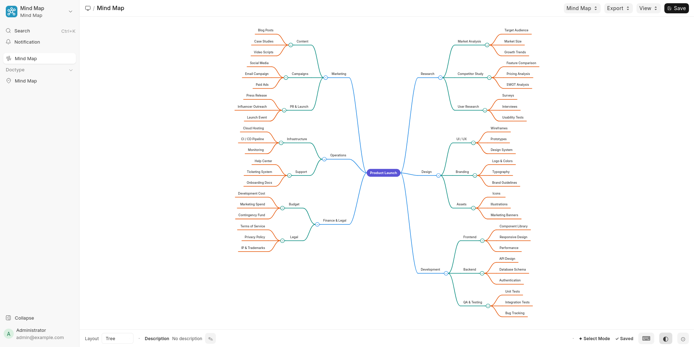

# Mind Map

Mind Map is a Frappe app for creating, editing, and navigating interactive mind maps inside Desk.

It is designed for fast note structuring, planning, documentation trees, product breakdowns, SOP maps, and knowledge organization. Maps are stored as JSON in a standard Frappe DocType, while editing happens in a dedicated visual page.

## What It Does

- Create and manage mind maps as Frappe documents.
- Open maps in a full-screen visual editor page.
- Edit node labels directly inside the map.
- Organize ideas in `Right` or `Tree` layout.
- Expand and collapse branches quickly.
- Reorder nodes with drag and drop.
- Export maps as `PNG`, `JPG`, or `SVG`.

## Main Features

### Visual Mind Map Page

The app includes a dedicated Desk page called `mind-map-viewer` for working on maps visually.

- Full-canvas editing experience
- Clean zoomable SVG-based map rendering
- Fit-to-screen action
- Canvas fullscreen mode with footer controls still visible
- Context menu for node actions
- Toolbar for open, save, export, and view controls
- Footer metadata showing document name and description

### Two Layout Modes

The app supports two working layouts:

- `Right`: Traditional single-direction mind map layout
- `Tree`: Bidirectional layout with branches on both left and right

Tree mode now keeps sibling placement more stable during collapse and expand actions, while still allowing deliberate side changes through reordering.

### Direct Node Editing

You can rename nodes directly in place.

- Double-click a node to edit
- `F2` to rename selected node
- New child and sibling nodes start in edit mode
- Text editing happens inline without opening a dialog

### Node Operations

Available actions include:

- Add child node
- Add sibling node
- Add parent node
- Rename node
- Delete node
- Expand or collapse node branches
- Focus a branch as a temporary working view and return to the full map
- Collapse or expand from the main node using its right-side toggle button

Most of these are available through both shortcuts and the node context menu.

### Drag and Drop

The editor supports drag and drop for structure changes.

- Reorder sibling nodes
- Reparent nodes under other nodes
- Visual drop indicator while dragging
- Root-level behavior in `Tree` layout respects side placement more intelligently

### Multi-Select and Lasso Selection

You can select multiple nodes for batch actions.

- `Shift`, `Ctrl`, or `Cmd` click to multi-select
- Drag on empty canvas to lasso-select multiple nodes
- Delete selected nodes together

### Pan and Zoom

Navigation is designed for larger maps.

- Mouse wheel zoom
- Spacebar pan mode
- Click-and-drag canvas navigation
- Fit map to screen with `F`
- Fullscreen mode for the working canvas, with `Esc` to exit
- Smooth viewport transitions for fit and branch focus actions

### Export

You can export maps for sharing or documentation.

- Export **PNG**
- Export **JPG**
- Export **SVG**

### Theme Support

The document based a theme selection:

- Light
- Dark
- Auto

### Autosave

Maps are marked dirty during editing and saved automatically after a short delay, while also supporting manual save from the toolbar and `Ctrl+S`.

## Keyboard Shortcuts

Current shortcuts shown in the app footer:

- `Tab`: Add child
- `Shift+Enter`: Add sibling
- `F2`: Rename
- `Del` / `Backspace`: Delete
- `Space`: Pan mode
- `Ctrl+S`: Save
- `Ctrl+Z`: Undo
- `F`: Fit screen

## Good Use Cases

- Project planning
- Process mapping
- Technical documentation outline
- Product or module breakdown
- SOP structure drafting
- Brainstorming and idea clustering
- Department, report, and workflow mapping

## License

MIT
